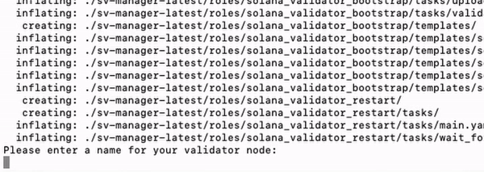

# LUMEN: AI-Powered Solana Validator Manager

### Automatically bootstrap, optimize, and monitor your Solana validator node with AI-driven efficiency

LUMEN is an enhanced AI-powered validator management framework built on the foundation of the open-source SV-Manager project. Combining Solana's speed and scalability with AI automation, LUMEN optimizes validator operations, maximizes staking rewards, and ensures robust participation in the Solana network.

---

## Key Features of LUMEN

### **AI-Driven Validator Optimization**
- Monitors and optimizes validator performance in real-time.
- Automatically adjusts configurations based on network conditions for maximum uptime and performance.
- Predicts load and reallocates resources to prevent slashing or missed rewards.

### **Automated Stake Management**
- Delegates and re-delegates SOL to maximize rewards.
- Balances staking distribution to promote network decentralization.
- Provides staking analytics to identify underperforming validators and recommend reallocations.

### **Dynamic Fee Adjustment**
- Uses AI to adjust validator commission fees dynamically based on market trends and competitor analysis.
- Ensures competitive positioning while maximizing validator earnings.

### **Real-Time Monitoring and Alerts**
- Comprehensive dashboard to track validator health, performance, and rewards.
- Sends real-time alerts for issues like downtime, missed slots, or penalty risks.

### **Energy Efficiency and Sustainability**
- Measures and optimizes validator energy usage.
- Rewards validators using renewable energy sources to promote green operations.

### **Validator Reputation Scoring**
- Assigns reputation scores based on performance, uptime, and community feedback.
- Encourages transparency and trust within the Solana ecosystem.

### **Governance Integration**
- Facilitates participation in governance votes directly through the platform.
- Provides AI-generated insights on proposals for informed decision-making.

### **Cross-Validator Collaboration**
- Enables validators to form groups and share resources, such as redundancy setups and backup nodes, using smart contracts for trustless collaboration.

---

## Quick Install

1. **Log in to your server**
2. **Create the key pair file (or upload it via SCP):**
   ```shell
   nano ~/validator-keypair.json
   ```
   Paste your key pair, save the file (ctrl-O), and exit (ctrl-X).

3. **If you have a vote account key pair, create the key pair file:**
   ```shell
   nano ~/vote-account-keypair.json
   ```
   Paste your key pair, save the file, and exit.

4. **Run the installation script:**
   ```shell
   /bin/bash -c "$(curl -fsSL https://raw.githubusercontent.com/mfactory-lab/lumen/latest/install/install_validator.sh)"
   ```

5. **Follow the wizard's instructions and enter your Node name:**

   

That’s it! Your validator node is set up and ready to contribute to the Solana network.

---

## How to Update Validator

To update your validator to the latest Solana version:
```shell
/bin/bash -c "$(curl -fsSL https://raw.githubusercontent.com/mfactory-lab/lumen/latest/install/update_test_validator_version.sh)" --version 1.14.2
```

---

## How to Update Monitoring

To update the monitoring system:
```shell
/bin/bash -c "$(curl -fsSL https://raw.githubusercontent.com/mfactory-lab/lumen/latest/install/update_monitoring.sh)"
```

---

## Advanced Features

For detailed technical specifications and advanced configurations, please refer to the [advanced documentation](docs/advanced.md).

---

## Utility of the $LUMEN Token

- **Access to Advanced Features:** Premium AI-powered optimization tools.
- **Staking Rewards Pool:** Stake $LUMEN for rewards, similar to SOL staking.
- **Governance and Upgrades:** Vote on protocol upgrades and feature additions.
- **Performance Incentives:** High-performing validators earn additional $LUMEN rewards.

---

## Useful Links

- [Solana](https://solana.com/)
- [Monitoring Dashboard](https://solana.thevalidators.io/)
- [Validator Docs](https://docs.solana.com/running-validator)

---

LUMEN redefines validator management by merging AI intelligence with Solana’s high-performance blockchain. By simplifying operations and boosting rewards, LUMEN empowers validators to thrive in the Solana ecosystem while contributing to its long-term decentralization and growth.
